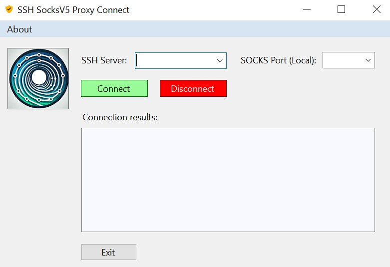

# SSH SocksV5 Proxy Connect

## Overview
SSH SocksV5 Proxy Connect is a Windows application that allows users to open a SOCKS proxy on the localhost via an SSH connection using a remote port forward tunnel. This tool simplifies the process of creating secure, tunneled connections to remote servers, facilitating secure access to resources and enhanced privacy.

For more information on SSH tunnels and proxies, you can refer to the following resource: [Offensive Security Guide to SSH Tunnels and Proxies](https://posts.specterops.io/offensive-security-guide-to-ssh-tunnels-and-proxies-b525cbd4d4c6).

## Features
- Connect to remote SSH servers.
- Open a SOCKS5 proxy on the localhost.
- Save and manage connection history for easy access.
- Validate IP addresses for secure connections.

## Installation
1. Clone the repository or download the source code.
2. Open the project in Visual Studio.
3. Build the solution to compile the application.
4. Run the application executable.

## Usage
1. Enter the SSH server IP address in the "SSH Server" field.
2. Specify the desired SOCKS port.
3. Click "Connect" to establish the SSH connection and open the SOCKS proxy.
4. Click "Disconnect" to close the connection and the proxy.

## Disclaimer
This application is intended for educational and legitimate use only. The developer is not responsible for any malicious usage or activities carried out using this software. Users should ensure they comply with all applicable laws and regulations regarding the use of SSH tunneling and proxy services.

## License
This project is licensed under the MIT License - see the [LICENSE](LICENSE) file for details.
